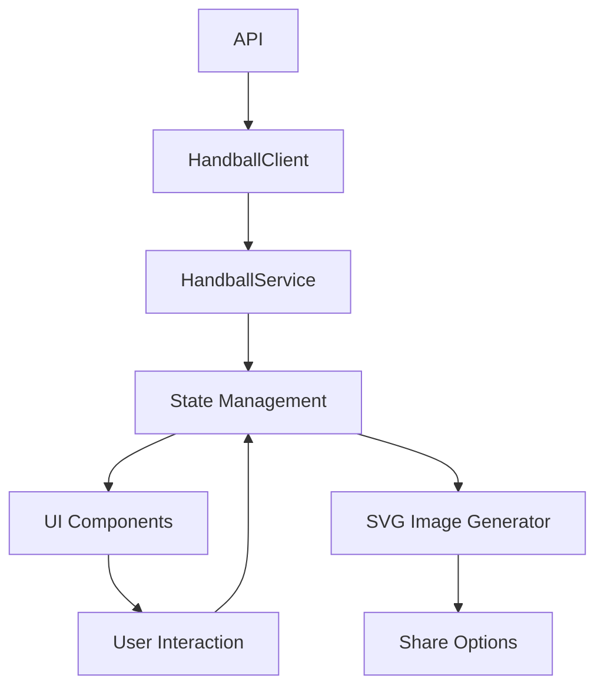
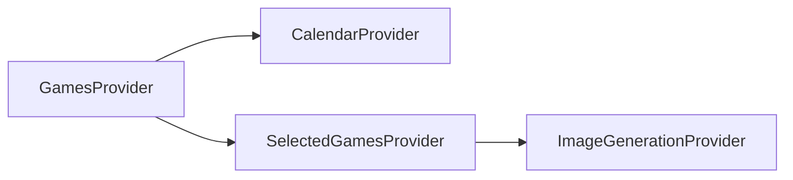
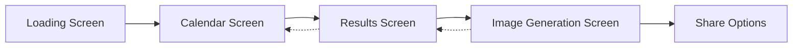

# NHB Results App Architecture Plan

## Overview

This document outlines the architecture plan for updating the NHB Results Flutter app with the following features:

1. On startup, query game results with a loading spinner
2. Display a calendar where only dates with game results are selectable
3. Show a table of results when a date is selected
4. Allow selection of multiple game results
5. Enable a "Generate" button when at least one game is selected
6. Display an image with share options when the button is clicked

## 1. Data Flow Architecture



The data flow follows these steps:
1. API data is fetched through the HandballClient
2. HandballService processes and filters the data
3. State management layer holds and manages the application state
4. UI components render based on the current state
5. User interactions trigger state changes
6. Selected game data is passed to the SVG Image Generator
7. Generated images can be shared through platform-specific share options

## 2. State Management Approach

For this application, we'll use **Riverpod** as the state management solution due to its:
- Better type safety compared to Provider
- Easier dependency overrides for testing
- More control over state lifecycle
- Simpler code organization with providers

We'll implement the following providers:



### Key Providers:

1. **GamesProvider**: Manages the fetching and caching of all game data
2. **CalendarProvider**: Manages calendar state and available dates
3. **SelectedGamesProvider**: Manages the currently selected date and games
4. **ImageGenerationProvider**: Manages the image generation process

## 3. Screen Navigation Flow



The navigation flow follows these steps:
1. App starts with a Loading Screen while fetching initial data
2. After data is loaded, user is presented with the Calendar Screen
3. Selecting a date navigates to the Results Screen
4. Selecting games and tapping "Generate" navigates to the Image Generation Screen
5. From there, the user can share the generated image
6. Back navigation allows returning to previous screens

## 4. Required Updates to Existing Services

### HandballClient Updates
- No significant changes required
- Consider adding caching mechanism for API responses

### HandballService Updates

1. Add method to get games by date:
   ```dart
   Future<List<HandballGame>> getGamesByDate(DateTime date) async {
     final allGames = await getAllGames();
     return allGames.where((game) {
       if (game.gameDateTime == null) return false;
       final gameDate = DateTime.parse(game.gameDateTime!);
       return gameDate.year == date.year && 
              gameDate.month == date.month && 
              gameDate.day == date.day;
     }).toList();
   }
   ```

2. Add method to get all dates with completed games:
   ```dart
   Future<List<DateTime>> getDatesWithCompletedGames() async {
     final completedGames = await getCompletedGames();
     final Set<String> uniqueDates = {};
     final List<DateTime> result = [];
     
     for (final game in completedGames) {
       if (game.gameDateTime != null) {
         final dateTime = DateTime.parse(game.gameDateTime!);
         final dateString = '${dateTime.year}-${dateTime.month}-${dateTime.day}';
         if (!uniqueDates.contains(dateString)) {
           uniqueDates.add(dateString);
           result.add(DateTime(dateTime.year, dateTime.month, dateTime.day));
         }
       }
     }
     
     return result..sort((a, b) => b.compareTo(a)); // Sort descending
   }
   ```

3. Enhance error handling and loading state management

### HandballTransformer Updates

1. Add support for handling multiple selected games:
   ```dart
   static List<Match> fromSelectedHandballGames(List<HandballGame> games) {
     // Sort games by date if needed
     final sortedGames = List<HandballGame>.from(games)
       ..sort((a, b) {
         if (a.gameDateTime == null) return 1;
         if (b.gameDateTime == null) return -1;
         return DateTime.parse(a.gameDateTime!)
             .compareTo(DateTime.parse(b.gameDateTime!));
       });
     
     return fromHandballGames(sortedGames);
   }
   ```

2. Ensure date formatting is consistent across the app

### SVG Image Generator Updates

1. Modify to handle user-selected games instead of just the most recent ones:
   ```dart
   static Future<Uint8List?> generateImageFromSelectedGames(List<HandballGame> selectedGames) async {
     // Transform HandballGame objects to Match objects
     final matches = HandballTransformer.fromSelectedHandballGames(selectedGames);
     
     // Choose appropriate template based on number of games
     final templateCount = matches.length > 4 ? 4 : matches.length;
     final template = 'assets/www/results_${templateCount}.svg';
     
     // Generate the image using the transformed matches
     return generateImageData(template, matches);
   }
   ```

2. Ensure proper template selection based on number of selected games

## 5. New Components and Screens

### 1. Loading Screen
- Shows loading spinner while fetching initial data
- Transitions to Calendar Screen once data is loaded
- Displays error message if data fetching fails

```dart
class LoadingScreen extends StatelessWidget {
  @override
  Widget build(BuildContext context) {
    return Scaffold(
      body: Center(
        child: Column(
          mainAxisAlignment: MainAxisAlignment.center,
          children: [
            CircularProgressIndicator(),
            SizedBox(height: 16),
            Text('Loading game results...'),
          ],
        ),
      ),
    );
  }
}
```

### 2. Calendar Screen
- Calendar widget showing dates with available game results
- Highlights dates with available games
- Non-game dates are disabled/grayed out
- Tapping a date navigates to Results Screen

```dart
class CalendarScreen extends ConsumerWidget {
  @override
  Widget build(BuildContext context, WidgetRef ref) {
    final calendarState = ref.watch(calendarProvider);
    
    return Scaffold(
      appBar: AppBar(title: Text('NHB Match Results')),
      body: calendarState.when(
        loading: () => Center(child: CircularProgressIndicator()),
        error: (error, _) => Center(child: Text('Error: $error')),
        data: (dates) => CalendarWidget(
          availableDates: dates,
          onDateSelected: (date) {
            // Navigate to results screen with selected date
          },
        ),
      ),
    );
  }
}
```

### 3. Results Screen
- Displays table of game results for selected date
- Allows multi-selection of games
- Shows "Generate" button (enabled when at least one game is selected)
- Button navigates to Image Generation Screen

```dart
class ResultsScreen extends ConsumerWidget {
  final DateTime selectedDate;
  
  const ResultsScreen({required this.selectedDate});
  
  @override
  Widget build(BuildContext context, WidgetRef ref) {
    final gamesState = ref.watch(selectedGamesProvider);
    
    return Scaffold(
      appBar: AppBar(
        title: Text('Game Results'),
        leading: BackButton(),
      ),
      body: Column(
        children: [
          DateHeader(date: selectedDate),
          Expanded(
            child: GameResultsList(
              games: gamesState.availableGames,
              selectedGames: gamesState.selectedGames,
              onGameToggled: (game) {
                ref.read(selectedGamesProvider.notifier).toggleGameSelection(game);
              },
            ),
          ),
        ],
      ),
      floatingActionButton: gamesState.selectedGames.isNotEmpty
        ? FloatingActionButton.extended(
            onPressed: () {
              // Navigate to image generation screen
            },
            label: Text('Generate Image'),
            icon: Icon(Icons.image),
          )
        : null,
    );
  }
}
```

### 4. Image Generation Screen
- Displays generated image based on selected games
- Provides share options
- Option to go back and select different games

```dart
class ImageGenerationScreen extends ConsumerWidget {
  @override
  Widget build(BuildContext context, WidgetRef ref) {
    final imageState = ref.watch(imageGenerationProvider);
    
    return Scaffold(
      appBar: AppBar(
        title: Text('Generated Image'),
        leading: BackButton(),
      ),
      body: Center(
        child: imageState.when(
          loading: () => CircularProgressIndicator(),
          error: (error) => Text('Error: $error'),
          data: (imageData) => Column(
            mainAxisAlignment: MainAxisAlignment.center,
            children: [
              Expanded(
                child: InteractiveViewer(
                  child: Image.memory(imageData),
                ),
              ),
            ],
          ),
        ),
      ),
      floatingActionButton: imageState.maybeWhen(
        data: (imageData) => FloatingActionButton(
          onPressed: () {
            // Share image
          },
          child: Icon(Icons.share),
        ),
        orElse: () => null,
      ),
    );
  }
}
```

## 6. Data Models

### New Models

1. **CalendarDateModel**
   ```dart
   class CalendarDateModel {
     final DateTime date;
     final bool hasGames;
     final int gameCount;
     
     const CalendarDateModel({
       required this.date,
       required this.hasGames,
       this.gameCount = 0,
     });
   }
   ```

2. **SelectedGamesState**
   ```dart
   class SelectedGamesState {
     final List<HandballGame> availableGames;
     final List<HandballGame> selectedGames;
     final DateTime selectedDate;
     final bool isLoading;
     final String? errorMessage;
     
     const SelectedGamesState({
       required this.availableGames,
       required this.selectedGames,
       required this.selectedDate,
       this.isLoading = false,
       this.errorMessage,
     });
     
     SelectedGamesState copyWith({
       List<HandballGame>? availableGames,
       List<HandballGame>? selectedGames,
       DateTime? selectedDate,
       bool? isLoading,
       String? errorMessage,
     }) {
       return SelectedGamesState(
         availableGames: availableGames ?? this.availableGames,
         selectedGames: selectedGames ?? this.selectedGames,
         selectedDate: selectedDate ?? this.selectedDate,
         isLoading: isLoading ?? this.isLoading,
         errorMessage: errorMessage,
       );
     }
   }
   ```

3. **ImageGenerationState**
   ```dart
   class ImageGenerationState {
     final Uint8List? imageData;
     final bool isGenerating;
     final String? errorMessage;
     final List<HandballGame> selectedGames;
     
     const ImageGenerationState({
       this.imageData,
       required this.isGenerating,
       this.errorMessage,
       required this.selectedGames,
     });
     
     ImageGenerationState copyWith({
       Uint8List? imageData,
       bool? isGenerating,
       String? errorMessage,
       List<HandballGame>? selectedGames,
     }) {
       return ImageGenerationState(
         imageData: imageData ?? this.imageData,
         isGenerating: isGenerating ?? this.isGenerating,
         errorMessage: errorMessage,
         selectedGames: selectedGames ?? this.selectedGames,
       );
     }
   }
   ```

## 7. Detailed Component Implementation

### HandballServiceProvider
```dart
final handballServiceProvider = Provider<HandballService>((ref) {
  final client = HandballGraphQLClient();
  return HandballService(client: client);
});
```

### CalendarProvider
```dart
final calendarProvider = StateNotifierProvider<CalendarNotifier, AsyncValue<List<CalendarDateModel>>>((ref) {
  final handballService = ref.watch(handballServiceProvider);
  return CalendarNotifier(handballService);
});

class CalendarNotifier extends StateNotifier<AsyncValue<List<CalendarDateModel>>> {
  final HandballService _handballService;
  
  CalendarNotifier(this._handballService) : super(AsyncValue.loading()) {
    loadDatesWithGames();
  }
  
  Future<void> loadDatesWithGames() async {
    try {
      state = AsyncValue.loading();
      
      // Get all dates with completed games
      final dates = await _handballService.getDatesWithCompletedGames();
      
      // Create calendar models
      final calendarDates = <CalendarDateModel>[];
      
      for (final date in dates) {
        final games = await _handballService.getGamesByDate(date);
        calendarDates.add(CalendarDateModel(
          date: date,
          hasGames: games.isNotEmpty,
          gameCount: games.length,
        ));
      }
      
      state = AsyncValue.data(calendarDates);
    } catch (e, stackTrace) {
      state = AsyncValue.error(e, stackTrace);
    }
  }
}
```

### SelectedGamesProvider
```dart
final selectedGamesProvider = StateNotifierProvider<SelectedGamesNotifier, SelectedGamesState>((ref) {
  final handballService = ref.watch(handballServiceProvider);
  return SelectedGamesNotifier(handballService);
});

class SelectedGamesNotifier extends StateNotifier<SelectedGamesState> {
  final HandballService _handballService;
  
  SelectedGamesNotifier(this._handballService) : super(SelectedGamesState(
    availableGames: [],
    selectedGames: [],
    selectedDate: DateTime.now(),
    isLoading: false,
  ));
  
  Future<void> selectDate(DateTime date) async {
    state = state.copyWith(
      isLoading: true,
      selectedDate: date,
      selectedGames: [],
    );
    
    try {
      final games = await _handballService.getGamesByDate(date);
      state = state.copyWith(
        availableGames: games,
        isLoading: false,
      );
    } catch (e) {
      state = state.copyWith(
        isLoading: false,
        errorMessage: 'Failed to load games: $e',
      );
    }
  }
  
  void toggleGameSelection(HandballGame game) {
    final currentlySelected = List<HandballGame>.from(state.selectedGames);
    
    if (currentlySelected.any((g) => g.objectId == game.objectId)) {
      currentlySelected.removeWhere((g) => g.objectId == game.objectId);
    } else {
      currentlySelected.add(game);
    }
    
    state = state.copyWith(selectedGames: currentlySelected);
  }
  
  void clearSelection() {
    state = state.copyWith(selectedGames: []);
  }
}
```

### ImageGenerationProvider
```dart
final imageGenerationProvider = StateNotifierProvider.autoDispose<ImageGenerationNotifier, AsyncValue<Uint8List>>((ref) {
  final selectedGames = ref.watch(selectedGamesProvider).selectedGames;
  return ImageGenerationNotifier(selectedGames);
});

class ImageGenerationNotifier extends StateNotifier<AsyncValue<Uint8List>> {
  final List<HandballGame> _selectedGames;
  
  ImageGenerationNotifier(this._selectedGames) : super(AsyncValue.loading()) {
    generateImage();
  }
  
  Future<void> generateImage() async {
    try {
      state = AsyncValue.loading();
      
      // Transform HandballGame objects to Match objects
      final matches = HandballTransformer.fromSelectedHandballGames(_selectedGames);
      
      // Choose appropriate template based on number of games
      final templateCount = matches.length > 4 ? 4 : matches.length;
      final template = 'assets/www/results_${templateCount}.svg';
      
      // Generate the image
      final imageData = await SvgImageGenerator.generateImageData(template, matches);
      
      if (imageData != null) {
        state = AsyncValue.data(imageData);
      } else {
        state = AsyncValue.error('Failed to generate image', StackTrace.current);
      }
    } catch (e, stackTrace) {
      state = AsyncValue.error(e, stackTrace);
    }
  }
}
```

## 8. UI Implementation Details

### Calendar Widget
- Use `table_calendar` package for the calendar UI
- Custom styling to highlight dates with games
- Event markers to indicate number of games per date

```dart
class CalendarWidget extends StatelessWidget {
  final List<CalendarDateModel> availableDates;
  final Function(DateTime) onDateSelected;
  
  const CalendarWidget({
    required this.availableDates,
    required this.onDateSelected,
  });
  
  @override
  Widget build(BuildContext context) {
    return TableCalendar(
      firstDay: DateTime.utc(2020, 1, 1),
      lastDay: DateTime.now(),
      focusedDay: DateTime.now(),
      calendarFormat: CalendarFormat.month,
      eventLoader: (day) {
        return availableDates
            .where((d) => isSameDay(d.date, day) && d.hasGames)
            .map((d) => d.gameCount)
            .toList();
      },
      enabledDayPredicate: (day) {
        return availableDates.any((d) => isSameDay(d.date, day) && d.hasGames);
      },
      onDaySelected: (selectedDay, focusedDay) {
        onDateSelected(selectedDay);
      },
      calendarStyle: CalendarStyle(
        outsideDaysVisible: false,
        disabledTextStyle: TextStyle(color: Colors.grey[300]),
      ),
    );
  }
}
```

### Results Table
- Custom `ListView` with selectable items
- Checkbox or highlight effect for selected games
- Game details displayed in each row (teams, scores, venue)

```dart
class GameResultsList extends StatelessWidget {
  final List<HandballGame> games;
  final List<HandballGame> selectedGames;
  final Function(HandballGame) onGameToggled;
  
  const GameResultsList({
    required this.games,
    required this.selectedGames,
    required this.onGameToggled,
  });
  
  @override
  Widget build(BuildContext context) {
    return ListView.builder(
      itemCount: games.length,
      itemBuilder: (context, index) {
        final game = games[index];
        final isSelected = selectedGames.any((g) => g.objectId == game.objectId);
        
        return GameResultCard(
          game: game,
          isSelected: isSelected,
          onToggle: () => onGameToggled(game),
        );
      },
    );
  }
}

class GameResultCard extends StatelessWidget {
  final HandballGame game;
  final bool isSelected;
  final VoidCallback onToggle;
  
  const GameResultCard({
    required this.game,
    required this.isSelected,
    required this.onToggle,
  });
  
  @override
  Widget build(BuildContext context) {
    return Card(
      elevation: isSelected ? 4 : 1,
      color: isSelected ? Colors.blue.shade50 : null,
      margin: EdgeInsets.symmetric(vertical: 4, horizontal: 8),
      child: InkWell(
        onTap: onToggle,
        child: Padding(
          padding: EdgeInsets.all(12),
          child: Row(
            children: [
              Checkbox(
                value: isSelected,
                onChanged: (_) => onToggle(),
              ),
              Expanded(
                child: Column(
                  crossAxisAlignment: CrossAxisAlignment.start,
                  children: [
                    Text(
                      '${game.homeTeamName ?? "Unknown"} vs ${game.awayTeamName ?? "Unknown"}',
                      style: TextStyle(fontWeight: FontWeight.bold),
                    ),
                    SizedBox(height: 4),
                    Text(
                      '${game.homeTeamScore ?? "-"} - ${game.awayTeamScore ?? "-"}',
                      style: TextStyle(fontSize: 18, fontWeight: FontWeight.bold),
                    ),
                    SizedBox(height: 4),
                    Text(
                      '${game.venueName ?? "Unknown venue"} • ${game.leagueShortName ?? "Unknown league"}',
                      style: TextStyle(color: Colors.grey[600]),
                    ),
                  ],
                ),
              ),
            ],
          ),
        ),
      ),
    );
  }
}
```

### Generate Button
- Floating action button or prominent button at bottom of screen
- Disabled state when no games are selected
- Animation effect when becoming enabled

```dart
FloatingActionButton.extended(
  onPressed: selectedGames.isNotEmpty
    ? () => Navigator.push(
        context,
        MaterialPageRoute(
          builder: (context) => ImageGenerationScreen(),
        ),
      )
    : null,
  label: Text('Generate Image'),
  icon: Icon(Icons.image),
  backgroundColor: selectedGames.isNotEmpty ? Colors.blue : Colors.grey,
)
```

### Image Display
- Zoomable image view
- Share button with platform-specific share options
- Option to regenerate with different selection

```dart
class ImageDisplay extends StatelessWidget {
  final Uint8List imageData;
  final VoidCallback onShare;
  
  const ImageDisplay({
    required this.imageData,
    required this.onShare,
  });
  
  @override
  Widget build(BuildContext context) {
    return Column(
      children: [
        Expanded(
          child: InteractiveViewer(
            minScale: 0.5,
            maxScale: 3.0,
            child: Image.memory(imageData),
          ),
        ),
        Padding(
          padding: EdgeInsets.all(16),
          child: ElevatedButton.icon(
            onPressed: onShare,
            icon: Icon(Icons.share),
            label: Text('Share Image'),
            style: ElevatedButton.styleFrom(
              padding: EdgeInsets.symmetric(vertical: 12, horizontal: 24),
            ),
          ),
        ),
      ],
    );
  }
}
```

## 9. Error Handling and Edge Cases

1. **No Internet Connection**
   - Implement connectivity checking before API calls
   - Cache previously fetched data for offline access
   - Show clear error messages with retry options

2. **No Games Available**
   - Display friendly message when no games are available for a date
   - Provide guidance to select a different date

3. **Image Generation Failures**
   - Handle SVG parsing errors gracefully
   - Provide specific error messages based on failure type
   - Add retry mechanism for image generation

4. **API Changes**
   - Implement robust parsing with null safety
   - Add version checking for API compatibility
   - Include fallback values for missing data

## 10. Testing Strategy

1. **Unit Tests**
   - Test providers and state management logic
   - Test data transformation and formatting
   - Test date handling and filtering

2. **Widget Tests**
   - Test calendar widget functionality
   - Test game selection mechanism
   - Test navigation between screens

3. **Integration Tests**
   - Test end-to-end user flows
   - Test with mock API responses
   - Test image generation and sharing

## 11. Performance Considerations

1. **Data Caching**
   - Implement a caching layer for API responses
   - Store calendar data to reduce repeated API calls
   - Cache generated images temporarily

2. **Lazy Loading**
   - Load game details only when a date is selected
   - Implement pagination if the number of games becomes large

3. **Image Optimization**
   - Optimize SVG rendering process
   - Consider image compression before sharing
   - Implement proper memory management for large images

## Implementation Plan

1. **Phase 1: Core Updates**
   - Update HandballService with new methods
   - Implement state management providers
   - Create new data models

2. **Phase 2: UI Implementation**
   - Create Loading Screen
   - Implement Calendar Screen with date filtering
   - Build Results Screen with selection functionality

3. **Phase 3: Image Generation**
   - Update SVG Image Generator
   - Implement Image Generation Screen
   - Add sharing functionality

4. **Phase 4: Testing & Refinement**
   - Write tests for all components
   - Optimize performance
   - Polish UI and user experience